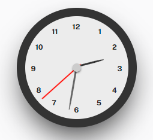

# 🕰️ React Analog Clock



**A lightweight, customizable analog clock component for React** — supports dynamic resizing, color themes, timezone offset, and optional hour numbers.

📦 [NPM](https://www.npmjs.com/package/@sinaasghari/react-analog-clock)  
🌐 Live Preview (optional: add CodeSandbox or storybook link)

---

## 🚀 Installation

```bash
npm install @sinaasghari/react-analog-clock
```

or with Yarn:

```bash
yarn add @sinaasghari/react-analog-clock
```

---

## 📦 Usage

```tsx
import AnalogClock from "@sinaasghari/react-analog-clock";

export default function App() {
  return (
    <AnalogClock
      size={300}
      showNumbers={true}
      centerDotColor="#000"
      hourColor="#333"
      minutesColor="#555"
      secondColor="red"
      timezoneOffset={60} // Timezone offset in minutes (e.g. GMT+1 = 60)
    />
  );
}
```

---

## ⚙️ Props

| Prop              | Type                | Default   | Description                                                                 |
|-------------------|---------------------|-----------|-----------------------------------------------------------------------------|
| `size`            | `number`            | `300`     | Overall size of the clock (scales everything proportionally)               |
| `showNumbers`     | `boolean`           | `true`    | Whether to show the hour numbers (1–12)                                    |
| `centerDotColor`  | `string` (CSS color)| `"#ccc"`  | Color of the central pivot dot                                             |
| `hourColor`       | `string` (CSS color)| `"#333"`  | Color of the hour hand                                                     |
| `minutesColor`    | `string` (CSS color)| `"#666"`  | Color of the minute hand                                                   |
| `secondColor`     | `string` (CSS color)| `"red"`   | Color of the second hand                                                   |
| `style`           | `React.CSSProperties` | `{}`    | Custom inline styles applied to the clock container                        |
| `timezoneOffset`  | `number` (minutes)  | `0`       | Timezone offset in minutes (e.g. Iran = `+210`, New York = `-240`)         |

---

## 🖌️ Styling

The component uses a `style.css` file internally. You can override styles using the `style` prop or by overriding class names:

- `.clock`
- `.dot`
- `.hour`, `.twelve`, `.one`, ..., `.eleven`
- `.hour-hand`
- `.minute-hand`
- `.second-hand`

---

## 🕓 Timezone Support

The `timezoneOffset` prop allows you to set the clock to a specific timezone.

Example:  
For Iran (UTC+3:30), pass `timezoneOffset={210}`.

---

## 📌 Notes

- The clock updates every second using `setInterval`.
- Fully responsive: the size scales proportionally using CSS `transform: scale(...)`.

---

## 📃 License

MIT © [Sina Asghari](https://github.com/sinaasghari)
